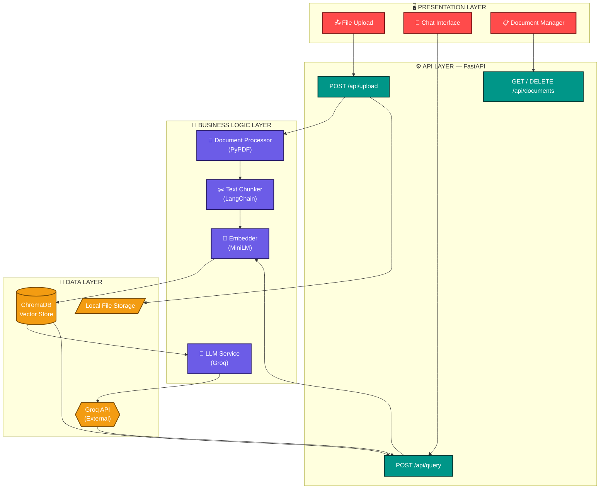

<div align="center">


<p align="center">
  
  
  
  
</p>

<p align="center">
  
  
  
  
  
  
</p>

<br/>

> **Upload your PDFs. Ask anything. Get intelligent, source-grounded answers — powered by RAG.**

<p align="center">
  <a href="#-quick-start"><strong>Quick Start</strong></a> ·
  <a href="#-live-demo"><strong>Live Demo</strong></a> ·
  <a href="#-api-reference"><strong>API Docs</strong></a> ·
  <a href="#-docker-setup"><strong>Docker</strong></a> ·
  <a href="#️-future-improvements"><strong>Roadmap</strong></a>
</p>

</div>

---

## 📚 Table of Contents

<details>
<summary>Click to expand</summary>

- [🌐 Live Demo](#-live-demo)
- [❗ Problem Statement](#-problem-statement)
- [🎯 Objectives](#-objectives)
- [✨ Key Features](#-key-features)
- [🏗️ System Architecture](#️-system-architecture)
- [🔄 End-to-End Workflow](#-end-to-end-workflow)
- [🛠️ Technology Stack](#️-technology-stack)
- [📁 Project Structure](#-project-structure)
- [⚡ Quick Start](#-quick-start)
- [🐳 Docker Setup](#-docker-setup)
- [🔐 Environment Variables](#-environment-variables)
- [🖥️ Running Locally](#️-running-locally)
- [📡 API Reference](#-api-reference)
- [📸 Screenshots](#-screenshots)
- [💡 Example Usage](#-example-usage)
- [⚡ Performance Highlights](#-performance-highlights)
- [🧗 Challenges Faced](#-challenges-faced)
- [🗺️ Future Improvements](#️-future-improvements)
- [🏆 Resume Highlights](#-resume-highlights)
- [👨‍💻 Author](#-author)
- [📄 License](#-license)

</details>

---

## 🌐 Live Demo

<div align="center">

| Service | URL | Status |
|---------|-----|--------|
| 🖥️ **Frontend** (Streamlit) | [smart-docs.streamlit.app](https://smart-document-frontend.onrender.com/) |  |
| ⚙️ **Backend API** (FastAPI) | [api.smart-docs.railway.app](https://end-to-end-ragpipeline-production.up.railway.app) |  |
| 📖 **API Docs** (Swagger) | [api.smart-docs.railway.app/docs](https://end-to-end-ragpipeline-production.up.railway.app/docs) |  |


</div>

---

## ❗ Problem Statement

Large Language Models (LLMs) like Llama and GPT are powerful, but they have a fundamental limitation — **their knowledge is frozen at the training cutoff date** and they have **no access to private or proprietary documents**.

This creates real problems in organizations:

- 📋 Legal teams cannot query internal contract databases
- 🏥 Healthcare teams cannot ask questions about patient-specific reports
- 🏢 Companies cannot let employees search internal knowledge bases
- 🎓 Researchers cannot interactively query their own research papers
- 💰 Finance teams cannot analyze uploaded financial statements

**Standard LLMs also hallucinate** — generating confident-sounding but factually incorrect answers when they don't know something. This is unacceptable in professional settings.

**Smart Documents Insights solves this** by combining the reasoning power of an LLM with the precision of semantic document retrieval — grounding every answer in the user's own uploaded content.

---

## 🎯 Objectives

- ✅ Build a complete **end-to-end RAG pipeline** from document ingestion to answer generation
- ✅ Enable **multi-document upload** with cross-document semantic search
- ✅ Implement **document-level filtering** — search one document or all documents
- ✅ Provide **source citations** with every answer for full transparency
- ✅ Achieve **fast response times** using Groq's LPU-accelerated inference
- ✅ Deploy as a **production-ready, Dockerized application**
- ✅ Maintain a **clean, layered architecture** that scales with new features

---

## ✨ Key Features

<table>
<tr>
<td width="50%">

### 🤖 AI Capabilities
- **Semantic Search** — finds relevant content by meaning, not keywords
- **Multi-Document RAG** — query across multiple PDFs simultaneously
- **Source Attribution** — every answer shows the source document
- **Context-Aware Answers** — Groq-hosted Llama model generates grounded responses
- **Hallucination Prevention** — the LLM only uses retrieved document context

</td>
<td width="50%">

### 🛠️ Technical Highlights
- **Auto Document Processing** — upload → index → ready in seconds
- **Metadata Filtering** — ChromaDB `where` clause for doc-level search
- **Chunk Deduplication** — removes overlapping chunks from results
- **Persistent Storage** — ChromaDB data survives server restarts
- **Config-Driven Settings** — chunk size, overlap, and top-K via `.env`

</td>
</tr>
<tr>
<td width="50%">

### 🖥️ User Experience
- **ChatGPT-like Interface** — fixed bottom input, scrollable chat
- **Auto Upload Processing** — no manual "Process" button needed
- **Document Scope Selector** — search all documents or one specific file
- **Clean, Modern UI** — built with Streamlit
- **Document Management** — upload, list, and delete documents

</td>
<td width="50%">

### 🚀 DevOps & Quality
- **Full Docker Support** — `docker compose up` and you're live
- **Health Monitoring** — `/health` endpoint for uptime checks
- **Test Coverage** — pytest unit + integration tests
- **CLI Ingestion Tools** — bulk document loading scripts
- **Layered Architecture** — API → Service → Data separation

</td>
</tr>
</table>

---

## 🏗️ System Architecture

The diagram below shows how requests flow from the Streamlit UI, through the FastAPI layer, into the RAG business logic, and down to the storage/inference layer.



**Legend:** 🔴 Presentation (Streamlit) → 🟢 API (FastAPI) → 🟣 Business Logic (RAG Services) → 🟠 Data (ChromaDB / Groq / Disk)

---

## 🔄 End-to-End Workflow

### 📥 Pipeline A — Document Ingestion *(runs once per upload)*


| Step | Component | What Happens |
|:---:|-----------|---------------|
| 1️⃣ | **API Layer** | Validates file type, generates a unique `doc_id`, saves the raw file to disk |
| 2️⃣ | **Document Processor** | PyPDF extracts raw text from every page of the PDF |
| 3️⃣ | **Text Chunker** | LangChain's `RecursiveCharacterTextSplitter` splits text into overlapping chunks with metadata |
| 4️⃣ | **Embedder** | Sentence Transformers (`all-MiniLM-L6-v2`) converts each chunk into a 384-dimensional vector |
| 5️⃣ | **Vector Store** | ChromaDB persists the ids, embeddings, chunk text, and metadata to disk |

---

### 🔍 Pipeline B — Query & Answer *(runs on every question)*


| Step | Component | What Happens |
|:---:|-----------|---------------|
| 1️⃣ | **API Layer** | Validates the question, determines the search scope (all docs or one `doc_id`) |
| 2️⃣ | **Embedder** | Converts the question into the same 384-dimensional vector space |
| 3️⃣ | **ChromaDB** | Runs an HNSW approximate-nearest-neighbor search, optionally filtered by `doc_id` |
| 4️⃣ | **Dedup Logic** | Removes near-duplicate chunks caused by chunk overlap |
| 5️⃣ | **Prompt Builder** | Assembles a grounded prompt: system instructions + retrieved context + question |
| 6️⃣ | **LLM Service** | Sends the prompt to Groq's hosted Llama model for fast inference |
| 7️⃣ | **Response Builder** | Formats the final answer with a deduplicated list of source citations |

---

## 🛠️ Technology Stack

<div align="center">

| Layer | Technology | Purpose |
|-------|-----------|---------|
| **Frontend** | Streamlit | ChatGPT-style chat UI |
| **Backend** | FastAPI | REST API server |
| **Language** | Python 3.11 | Core language |
| **PDF Parsing** | PyPDF | Text extraction from PDFs |
| **Text Chunking** | LangChain | `RecursiveCharacterTextSplitter` |
| **Embeddings** | Sentence Transformers | Text → 384-dim vectors |
| **Embedding Model** | all-MiniLM-L6-v2 | Fast, CPU-based, lightweight |
| **Vector Database** | ChromaDB | Vector storage + HNSW search |
| **LLM** | Groq API | Fast LLM-based answer generation |
| **Containerization** | Docker + Docker Compose | Production deployment |
| **Version Control** | Git + GitHub | Source control & collaboration |

</div>

---

## 📁 Project Structure

> The tree below reflects the current module layout. It's organized in clean layers (API → Services → Data) so new features can be added without breaking existing ones.

<details open>
<summary>🗂️ Click to expand / collapse project tree</summary>

```
📦 smart-documents-insights/
│
├── 🐳 docker-compose.yml            # Multi-container orchestration
├── 📄 backend.Dockerfile            # FastAPI image
├── 📄 frontend.Dockerfile           # Streamlit image
├── 📄 .env.example                  # Environment template (safe to commit)
├── 📄 .env                          # Secrets — never commit ⛔
│
├── ⚙️ backend/
│   ├── 📁 app/
│   │   ├── 📄 main.py               # FastAPI app, CORS, router registration
│   │   ├── 📄 config.py             # Settings loaded from .env
│   │   │
│   │   ├── 📁 api/                  # Route handlers
│   │   │   ├── 📄 upload.py         # POST /upload, GET/DELETE /documents
│   │   │   └── 📄 query.py          # POST /query (optional doc_id filter)
│   │   │
│   │   ├── 📁 services/             # RAG pipeline logic
│   │   │   ├── 📄 document_processor.py   # PyPDF text extraction
│   │   │   ├── 📄 chunker.py              # LangChain chunking + metadata
│   │   │   ├── 📄 embedder.py             # Sentence Transformers (singleton)
│   │   │   └── 📄 llm_service.py          # Groq API + prompt builder
│   │   │
│   │   ├── 📁 db/
│   │   │   └── 📄 vector_store.py   # ChromaDB CRUD + metadata filtering
│   │   │
│   │   ├── 📁 models/
│   │   │   └── 📄 schemas.py        # Pydantic request/response models
│   │   │
│   │   └── 📁 utils/
│   │       ├── 📄 file_utils.py     # File save, type validation, UUID
│   │       └── 📄 logger.py         # Structured logging setup
│   │
│   ├── 📁 ingestion/                # CLI tools for bulk document loading
│   │   ├── 📄 ingest.py             # Single file ingestion
│   │   ├── 📄 batch_ingest.py       # Bulk folder ingestion
│   │   ├── 📄 clear_index.py        # Reset ChromaDB collection
│   │   └── 📄 check_index.py        # Inspect DB contents
│   │
│   ├── 📁 tests/                    # pytest test suite
│   └── 📄 requirements.txt
│
├── 🖥️ frontend/
│   ├── 📄 app.py                    # Streamlit chat UI
│   └── 📄 requirements.txt
│
├── 📁 docs/assets/                  # README images / demo assets
├── 📄 README.md
└── 📄 LICENSE
```

</details>

---

## ⚡ Quick Start

### Prerequisites

```bash
# Check Python version (3.11+ required)
python --version

# Get your FREE Groq API key
# → https://console.groq.com (no credit card needed)
```

### 1️⃣ Clone the Repository

```bash
git clone https://github.com/Sumitsharma12321/End-To-End-RAG_Pipeline.git
cd smart-documents-insights
```

### 2️⃣ Create a Virtual Environment

```bash
python -m venv venv

# Activate — Windows
venv\Scripts\activate

# Activate — Mac / Linux
source venv/bin/activate
```

### 3️⃣ Install Dependencies

```bash
pip install -r backend/requirements.txt
pip install -r frontend/requirements.txt
```

### 4️⃣ Configure Environment

```bash
cp .env.example .env
```

Edit `.env` and add your Groq API key:

```env
GROQ_API_KEY=gsk_your_actual_key_here
```

### 5️⃣ Start the Application

```bash
# Terminal 1 — Backend
cd backend
uvicorn app.main:app --reload --port 8000

# Terminal 2 — Frontend
streamlit run frontend/streamlit_app/app.py
```

### 6️⃣ Open in Browser

| Interface | URL |
|-----------|-----|
| 🖥️ Streamlit UI |https://smart-document-frontend.onrender.com/ |
| 📖 API Swagger Docs | https://end-to-end-ragpipeline-production.up.railway.app/docs |
| ❤️ Health Check | https://end-to-end-ragpipeline-production.up.railway.app/health |

---

## 🐳 Docker Setup

> The fastest way to run Smart Documents Insights — no environment setup needed.

```bash
# 1. Copy environment file
cp .env.example .env
# Edit .env and add: GROQ_API_KEY=gsk_your_key

# 2. Build images
docker compose build --no-cache

# 3. Start all containers in background
docker compose up -d

# 4. Verify everything is healthy
docker compose ps
curl http://localhost:8000/health
```

<details>
<summary>📋 More Docker commands</summary>

```bash
# ── View logs ────────────────────────────────────────────────
docker compose logs -f                    # All services
docker compose logs -f backend            # Backend only

# ── Stop / Restart ───────────────────────────────────────────
docker compose stop                       # Stop (data preserved)
docker compose down                       # Stop + remove containers
docker compose down -v                    # ⚠️ Also deletes volumes

# ── Rebuild after code changes ────────────────────────────────
docker compose up -d --build

# ── Debug inside container ────────────────────────────────────
docker exec -it smart_doc_backend bash
docker exec -it smart_doc_frontend bash

# ── Cleanup ────────────────────────────────────────────────────
docker system prune -a
```

</details>

---

## 🔐 Environment Variables

| Variable | Required | Default | Description |
|----------|:---:|---------|-------------|
| `GROQ_API_KEY` | ✅ | — | Groq API key from console.groq.com |
| `CHROMA_DB_PATH` | ❌ | `./chroma_db` | ChromaDB persistent storage path |
| `UPLOAD_DIR` | ❌ | `./uploaded_docs` | Uploaded files directory |
| `CHUNK_SIZE` | ❌ | `500` | Characters per text chunk |
| `CHUNK_OVERLAP` | ❌ | `60` | Overlap characters between chunks |
| `TOP_K` | ❌ | `5` | Number of chunks retrieved per query |
| `BACKEND_URL` | ❌ | `https://end-to-end-ragpipeline-production.up.railway.app/` | Backend URL (Docker: `http://backend:8000`) |

---

## 🖥️ Running Locally

### Backend Only (API Testing)

```bash
cd backend
uvicorn app.main:app --reload --port 8000

curl http://localhost:8000/health
curl http://localhost:8000/api/documents
```

### CLI Ingestion (Without UI)

```bash
cd backend

# Ingest a single PDF
python ingestion/ingest.py --file ./docs/report.pdf

# Ingest an entire folder
python ingestion/batch_ingest.py ./my_documents/

# Check what's indexed
python ingestion/check_index.py --query "What is machine learning?"

# Reset the database
python ingestion/clear_index.py
```

### Run Tests

```bash
cd backend
pip install pytest httpx

pytest tests/ -v
pytest tests/ --cov=app --cov-report=html
```

---

## 📡 API Reference

<details>
<summary>📮 POST /api/upload — Single document</summary>

```http
POST /api/upload
Content-Type: multipart/form-data
```

**Response `200 OK`:**
```json
{
  "doc_id": "550e8400-e29b-41d4-a716-446655440000",
  "filename": "research_report.pdf",
  "chunks_created": 47,
  "message": "'research_report.pdf' successfully processed.",
  "upload_time": "2026-01-15T10:30:00.123456"
}
```

</details>

<details>
<summary>🔍 POST /api/query — Ask a question</summary>

```http
POST /api/query
Content-Type: application/json
```

```json
{
  "question": "What are the main findings of the research?",
  "doc_id": "550e8400-e29b-41d4-a716-446655440000"
}
```
> `doc_id` is optional — omit it to search across all documents.

**Response `200 OK`:**
```json
{
  "answer": "The research identifies three main findings...",
  "sources": ["research_report.pdf"],
  "searched_in": "research_report.pdf"
}
```

</details>

<details>
<summary>📋 GET /api/documents — List all documents</summary>

```http
GET /api/documents
```

```json
{
  "documents": [
    {"doc_id": "uuid-1", "filename": "report.pdf", "chunks_count": 47}
  ],
  "total_documents": 1,
  "total_chunks": 47
}
```

</details>

<details>
<summary>🗑️ DELETE /api/documents/{doc_id} — Remove a document</summary>

```http
DELETE /api/documents/550e8400-e29b-41d4-a716-446655440000
```

```json
{
  "message": "Document deleted. 47 chunks removed.",
  "chunks_deleted": 47
}
```

</details>

<details>
<summary>❤️ GET /health — Health check</summary>

```json
{
  "status": "ok",
  "chromadb": "connected",
  "total_chunks": 156
}
```

</details>

---

## 📸 Screenshots

<div align="center">

| Feature | Screenshot |
|---------|-----------|
| 🏠 **Home — Empty State** |  |
| 📤 **Document Upload** |  |
| 💬 **Chat Interface** |  |
| 🔍 **Source Citations** |  |
| 📋 **Document Manager** |  |


</div>

---

## 💡 Example Usage

```bash
# Upload a PDF
curl -X POST http://localhost:8000/api/upload \
  -F "file=@research_paper.pdf" | python -m json.tool

# Query all documents
curl -X POST http://localhost:8000/api/query \
  -H "Content-Type: application/json" \
  -d '{"question": "What is the conclusion of the paper?"}' \
  | python -m json.tool

# Query a specific document
curl -X POST http://localhost:8000/api/query \
  -H "Content-Type: application/json" \
  -d '{"question": "What methodology was used?", "doc_id": "your-doc-id"}' \
  | python -m json.tool
```

### Sample Questions to Ask

```
📋 Summary:      "Give me a complete summary of this document."
💡 Insight:       "What are the key findings and conclusions?"
🔍 Specific:      "What methodology was used in the research?"
📊 Data:          "What statistics or numbers are mentioned?"
🔄 Cross-doc:     "Which document discusses machine learning?"
```

---


---

## 🧗 Challenges Faced

<details>
<summary>Click to read about technical challenges and how they were solved</summary>

### 1. Retrieval Quality — Wrong Chunks Being Retrieved
**Problem:** An initial chunk size of 1000 characters diluted relevant content inside large chunks, reducing retrieval precision.
**Solution:** Reduced `chunk_size` to 500 with `chunk_overlap=60`. Smaller, focused chunks → higher cosine similarity scores → more relevant retrieval.

### 2. Answer Quality After Adding Multi-Doc Support
**Problem:** When source labels were embedded directly inside context chunks, the LLM sometimes echoed the labels instead of explaining the content.
**Solution:** Context passed to the LLM was separated from citation metadata — citations are now built independently from chunk metadata and appended after generation.

### 3. Docker Networking — Frontend Couldn't Reach Backend
**Problem:** The frontend used `http://localhost:8000`, which works locally but fails inside Docker since each container has its own localhost.
**Solution:** Used Docker Compose service names as hostnames (`http://backend:8000`), relying on Docker's internal DNS.

### 4. Slow Cold Starts After Model Download
**Problem:** The Sentence Transformers model was being downloaded on every container start, adding significant startup delay.
**Solution:** Pre-downloaded the embedding model during the Docker image build step so it's baked into the image.

### 5. Duplicate Chunks in Retrieved Results
**Problem:** `chunk_overlap` caused adjacent chunks to share content, so near-duplicates appeared in the top-K results.
**Solution:** Added a deduplication step that compares the start of each retrieved chunk and removes near-duplicates before building the prompt.

</details>

---

## 🗺️ Future Improvements

| Priority | Feature | Description |
|:---:|---------|-------------|
| 🔴 High | **User Authentication** | Login and per-user document spaces |
| 🔴 High | **Chat History** | Persistent session and conversation history |
| 🟡 Medium | **Streaming Responses** | Real-time token streaming in the UI |
| 🟡 Medium | **Auto Document Summary** | Generate a TL;DR on upload |
| 🟡 Medium | **React Frontend** | Upgrade from Streamlit for production UX |
| 🟢 Low | **Hybrid Search** | Combine keyword and vector search for better recall |
| 🟢 Low | **Reranking** | Add a reranking step for improved precision |
| 🟢 Low | **Document Comparison** | Compare content across uploaded files |
| 🟢 Low | **Cloud Deployment** | Managed vector DB + object storage for scale |

---

## 🏆 Resume Highlights

> Copy these bullet points directly into your resume or LinkedIn:

```
• Architected and deployed a production-grade Retrieval-Augmented Generation (RAG)
  pipeline using FastAPI, ChromaDB, Sentence Transformers, and the Groq API

• Implemented multi-document semantic search with ChromaDB metadata filtering,
  enabling both cross-document and single-document retrieval

• Reduced end-to-end query latency by tuning chunk size/overlap and leveraging
  Groq's LPU-accelerated inference for fast LLM response generation

• Containerized the full application with Docker and Docker Compose, enabling
  one-command deployment for both backend and frontend services

• Wrote a pytest test suite covering the upload pipeline, embedding generation,
  vector retrieval, and LLM service integration

• Built a ChatGPT-like Streamlit interface with auto document processing,
  multi-document scope selection, and source citations

• Designed a clean, layered architecture: API layer (FastAPI) → Service layer
  (RAG pipeline) → Data layer (ChromaDB), following production patterns
```

---

## 👨‍💻 Author

<div align="center">


### Sumit Sharma

*AI Engineer | Agent Developer | Open Source Contributor*

[](https://github.com/Sumitsharma12321)
[](https://www.linkedin.com/in/sumit-sharma-9a7750319/)
[](https://yoursite.com)
[](mailto:sumitsharma9098660389@gmain.com)

> *"Built with FastAPI, ChromaDB, Groq, and Streamlit — one PDF at a time."*

</div>

---

## 📄 License

```
MIT License

Copyright (c) 2026 sumit sharma

Permission is hereby granted, free of charge, to any person obtaining a copy
of this software and associated documentation files (the "Software"), to deal
in the Software without restriction, including without limitation the rights
to use, copy, modify, merge, publish, distribute, sublicense, and/or sell
copies of the Software, and to permit persons to whom the Software is
furnished to do so, subject to the following conditions:

The above copyright notice and this permission notice shall be included in all
copies or substantial portions of the Software.
```

---

<div align="center">


**If this project helped you, please consider giving it a ⭐**

*Made with ❤️ | Smart Documents Insights*

</div>
